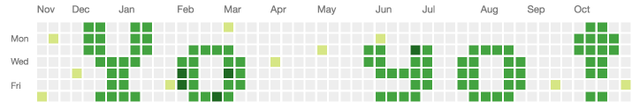

Green dots!
===========

Write on your GitHub profile!

__Work in progress. You shouldn't use it. Also, even if it wasn't a work in progress, you shouldn't use it. Just don't use it. I'm sorry.__

This takes a message, encodes it to a simple bitmap font, and generates a bunch of git commits in the past. To make your profile look like this:



10 second tutorial
------------------

Use greendots.py to generate a shell script with your commits in.

```bash
$ mkdir ../my-repo
$ ./greendots.py "Yo yo!" > ../my-repo/make-my-repo.sh
```

Then run that scrip to create a repo. This will generate lots of commits in your new repo.

```bash
$ cd ../my-repo
$ bash make-my-repo.sh
```

Now create your repo on github.com and push it. It'll take a minute or two, but you should now see your message in your profile at github.com/YOURUSERNAME.


Cleaning up
-----------

To remove this nonsense, just delete your repo from github.


Disclaimer
----------

This is ridiculous. Go away.

GitHub - sorry about this. Please don't ban my account.
